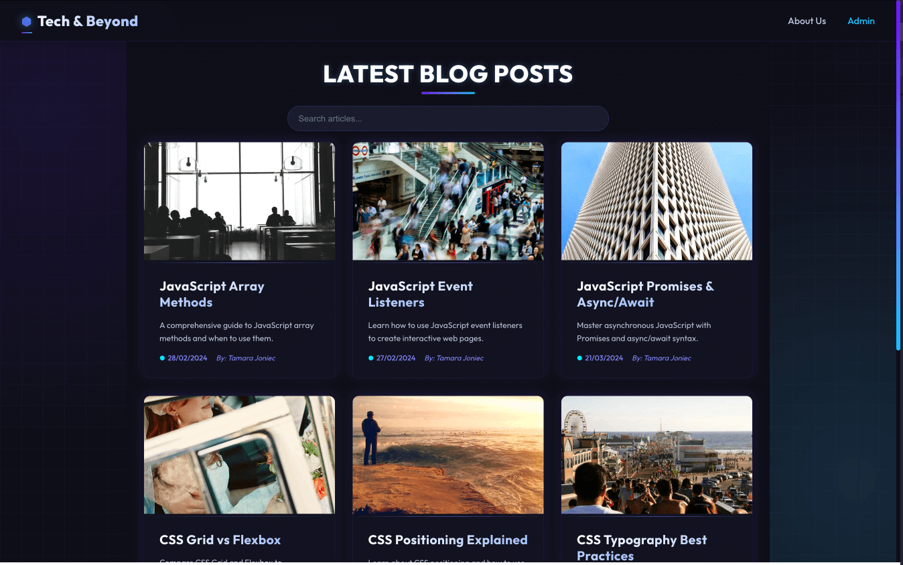

# Tech & Beyond

A modern, responsive blog platform showcasing web development articles and tutorials. Tech & Beyond is a passion project by Mike and Tamara Joniec, featuring content on both frontend and backend development.



## 🌟 Features

- **Dual Content Sources**: Articles from both static Markdown files and Drupal CMS
- **Responsive Design**: Modern, dark-themed UI that works across all devices
- **Search Functionality**: Real-time article filtering
- **Accessibility Focused**: WCAG compliant with optimized code snippets
- **Admin Interface**: Private administrative dashboard
- **SEO Optimized**: Properly structured content for search engines

## 🚀 Technologies

- **Frontend**: React with TypeScript
- **Styling**: CSS with modern techniques (Grid, Flexbox, Animations)
- **CMS**: Drupal with JSON:API
- **Content**: Markdown with frontmatter
- **Routing**: React Router for client-side navigation
- **Syntax Highlighting**: Enhanced code blocks with language detection

## 🔧 Project Structure

```
tech-and-beyond/
├── public/
│   ├── content/
│   │   └── blog/           # Markdown blog articles
│   └── index.html
├── src/
│   ├── components/         # Reusable UI components
│   ├── pages/              # Page components
│   ├── services/
│   │   └── api/            # API integration services
│   ├── utils/              # Utility functions
│   │   └── markdown.ts     # Markdown processing
│   └── App.tsx             # Main application component
└── README.md
```

## 💻 Getting Started

### Prerequisites

- Node.js (v14 or higher)
- npm or yarn
- Drupal instance with JSON:API enabled (optional for CMS features)

### Installation

1. Clone the repository:

   ```
   git clone https://github.com/TamaraJoniec/tech-and-beyond.git
   cd tech-and-beyond
   ```

2. Install dependencies:

   ```
   npm install
   ```

3. Start the development server:

   ```
   npm start
   ```

4. Open [http://localhost:3000](http://localhost:3000) to view it in the browser.

### Drupal Integration

For the Drupal CMS features to work, you need a Drupal instance with:

- JSON:API module enabled
- Article content type with appropriate fields
- CORS properly configured to allow requests from your frontend

The application will fallback to showing only markdown posts if the Drupal API is unavailable.

## 📝 Content Management

### Markdown Articles

Static blog posts are stored as markdown files in `public/content/blog/`. Each file includes frontmatter with metadata:

```markdown
---
title: Article Title
slug: article-slug
date: DD/MM/YYYY
excerpt: Brief description of the article
coverImage: URL to cover image
author: Author Name
---

Article content in markdown...
```

### Drupal Articles

Content managed in Drupal is fetched via the JSON:API endpoint and displayed alongside markdown content.

## 👥 About the Creators

Tech & Beyond is created and maintained by Mike and Tamara Joniec:

- **Mike Lamprakis**: Backend Developer specializing in Java
- **Tamara Joniec**: Junior Frontend Developer focused on React

## 📄 License

This project is licensed under the MIT License - see the LICENSE file for details.
